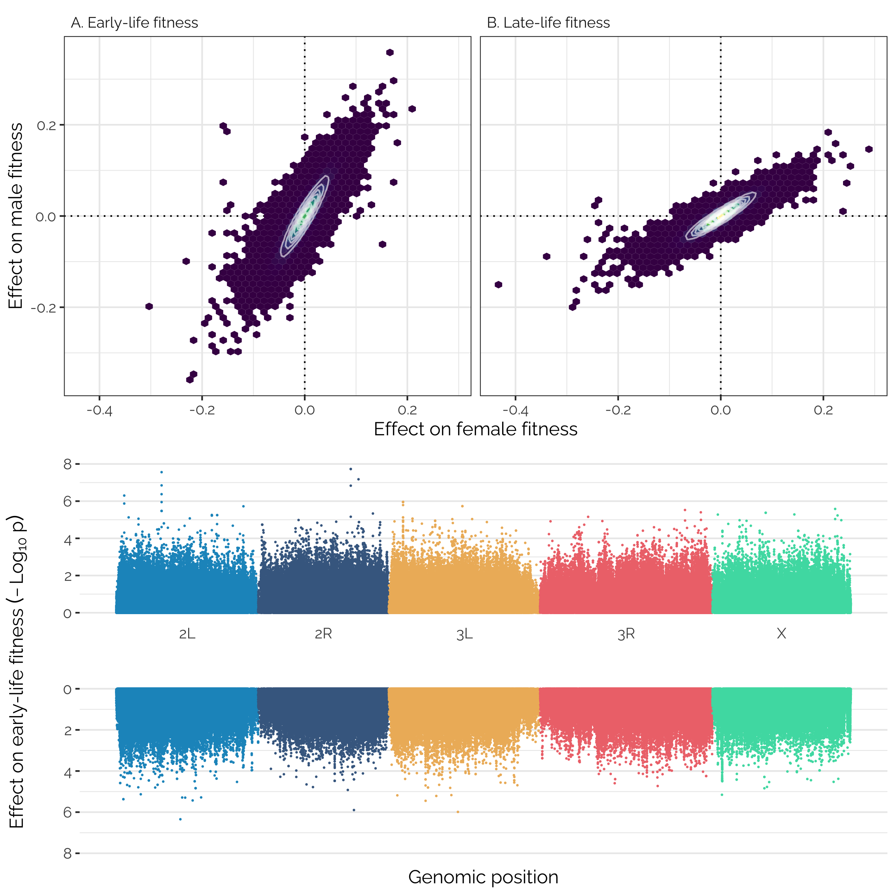

```{r setup, include=FALSE, results='hide', warning=FALSE, message=FALSE}
knitr::opts_chunk$set(echo = FALSE, warning = FALSE, message = FALSE)
```


***Figure 1***: Correlations among estimated line means for male and female early and late-life fitness. The line means were estimated from Bayesian mixed models that account for block effects and the non-independence of our early- and late-life fitness measurements.

\newpage



***Figure 2***: Panels A and B show the mashr-adjusted effect sizes of 1,207,357 loci (i.e. groups of one or more polymorphisms in complete linkage disequilibrium) on male and female early- and late-life fitness. The data have been binned into hexagons, with the colour and contour lines indicating the number of loci in each bin. Positive effect sizes indicate that the minor allele is associated with higher fitness and the major allele with lower fitness. Panel C shows a pair of Manhattan plots, showing the chromosomal position and $-Log_{10}$ $p$-value (from linear mixed model GWAS using GEMMA) for each locus's effect on female (top) and male (bottom) early-life fitness.


\newpage


***Figure 3***: Estimated mean effect size for groups of 1,000 variants, on male and female early-life (panel A) and late-life (panel B) fitness. The variant groups were created by sorting variants by their estimated effect size on female fitness, then dividing the sorted list into groups of 1,000. This analysis was performed on a pruned set of 208,987 variants in approximate linkage disequilibrium with one another. The observed positive relationships imply that large numbers of loci have small effects on the fitness of both sexes (see main text). The fit lines are from a quadratic linear regression, and the shaded area shows the standard error. 

\newpage


***Figure 4***: This plot tallies the number of loci (panels A-B) and transcripts (C-D) falling into each quartile in their effect on male and female fitness. Because the median effect size is essentially zero, quartiles 1-4 have been labelled negative, weakly negative, weakly positive, and positive respectively. For example, the largest red area in panel A illustrates the number of loci whose effect size for female early-life fitness was in quartile 1 (i.e. the 25% most negative effects), which were also in quartile 1 for male early-life fitness. 

\newpage


***Figure 5***: Distribution of evidence ratios across loci (panel A) and transcripts (panel B), illustrating the strength of evidence for a  concordant relationship with fitness (evidence ratio > 1, blue), or an antagonistic relationship (<1, red). The top row of both panels considers the evidence for concordance/antagonism between the sexes (within each age class), while the bottom row shows concordance/antagonism between age classes (within each sex). The figure illustrates that many loci and transcripts (i.e. those with large evidence ratios) show strong evidence for concordant effects across sexes and age classes. By contrast, there are are relatively few candidate sexually antagonistic loci (i.e. those with evidence ratios well below 1), somewhat more sexually antagonistic transcripts, and essentially zero age antagonistic loci or transcripts.

\newpage


***Figure 6***: Panels A and B show the predicted effects of minor allele frequency and chromosome, respectively, on the probability that a locus is among the top 1% candidate sexually antagonistic loci, as ranked by their evidence ratio. The model predictions come from a binomial GLM with minor allele frequency and chromosome as predictor variables. Panel C shows the predicted effect of average gene expression level on the probability that a transcript is among the top 1% candidate sexually antagonistic transcript, from a binomial GLM with expression level as a predictor. The dashed lines and error bars show 95% confidence intervals, estimated as 1.96SE. 

